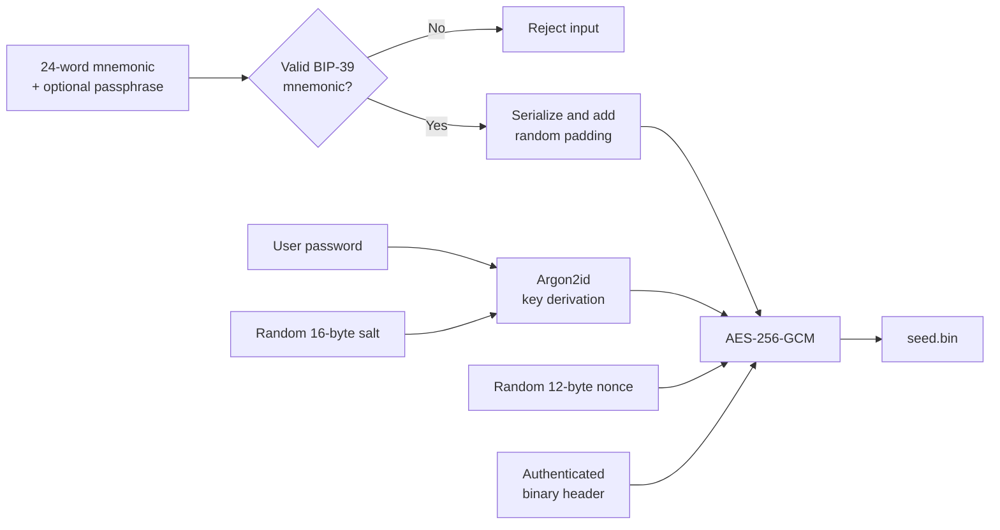

<div align="center">

# 🔐 DSB

### Digital Seed Phrase Backup

**A local-first desktop vault for encrypting and recovering BIP-39 seed phrases.**

[](https://www.python.org/)
[](https://flet.dev/)
[](#cryptographic-design)
[](#key-derivation)
[](#security-model)

<br>

DSB validates a 24-word English mnemonic, derives a strong key from a user
password, encrypts the backup, and stores it in an authenticated binary
container.

`Seed Phrase → Validate → Pad → Derive Key → Encrypt → seed.bin`

</div>

---

> [!CAUTION]
> A seed phrase controls the assets associated with its wallet. Test DSB with a
> disposable mnemonic before trusting it with real funds. Keep multiple offline
> backups, never lose the encryption password, and never upload a real backup to
> source control.

## ✨ Why DSB?

Plain-text seed backups are easy to read, copy, photograph, index, or leak.
DSB provides a small desktop interface for creating an encrypted backup without
requiring a remote service or network connection.

The current implementation provides:

- 24-word English BIP-39 mnemonic validation
- An optional 25th value for an additional wallet passphrase
- Password-strength requirements in the user interface
- Password-based key derivation with Argon2id
- Authenticated encryption with AES-256-GCM
- A compact, non-JSON binary backup format
- Random padding to reduce plaintext-length leakage
- Authentication of both the encrypted payload and binary header
- Atomic file replacement to reduce the risk of incomplete backups
- Tamper and incorrect-password detection
- Read-only compatibility with legacy `.dsb` JSON backups
- Automated tests for round trips, corruption detection, and legacy recovery

## 🧭 Application flow



The reverse path reads the binary header, derives the same key from the supplied
password, verifies the GCM authentication tag, removes the padding, and returns
the original values to read-only fields in the interface.

## 🏗️ Architecture

```text
DSB/
├── main.py          # Flet UI, navigation, validation, and file selection
├── crypto_utils.py  # KDF, encryption, binary format, and legacy reader
├── test.py          # Automated encryption and compatibility tests
└── README.md        # Project documentation
```

### Responsibility boundaries

| Component | Responsibility |
|---|---|
| `main.py` | Collects and validates user input, enforces the UI password policy, selects files, and displays results |
| `crypto_utils.py` | Derives keys, packs payloads, encrypts/decrypts data, validates containers, and writes files atomically |
| `test.py` | Verifies successful round trips, detects one-bit modifications, and confirms legacy `.dsb` compatibility |

The UI does not implement cryptographic primitives. It delegates all sensitive
format and cryptographic operations to `crypto_utils.py`.

## 🛡️ Cryptographic design

### Key derivation

DSB does not use the password directly as an encryption key. A unique random
salt is generated for every backup and passed to Argon2id:

| Parameter | Value |
|---|---:|
| Variant | Argon2id |
| Salt | 16 random bytes |
| Time cost | 3 |
| Memory cost | 65,536 KiB |
| Parallelism | 2 |
| Derived key | 32 bytes / 256 bits |

The random salt ensures that two backups protected by the same password still
derive independently salted keys. Argon2id increases the cost of password
guessing by requiring both computation and memory.

### Authenticated encryption

The padded payload is encrypted using AES-256-GCM:

| Property | Value |
|---|---:|
| Cipher | AES |
| Key size | 256 bits |
| Mode | GCM |
| Nonce | 12 random bytes per encryption |
| Authentication tag | 16 bytes |
| Associated data | Complete binary header |

GCM provides confidentiality and integrity. Modifying the ciphertext or any
authenticated header byte causes decryption to fail.

### Plaintext packing and padding

Before encryption, DSB creates the following internal payload:

```text
┌──────────────────┬────────────────────────┬──────────────────────┐
│ Seed length      │ UTF-8 seed data        │ Random padding       │
│ 2 bytes          │ variable               │ variable             │
└──────────────────┴────────────────────────┴──────────────────────┘
```

The payload is at least 512 bytes and grows in 256-byte blocks. This prevents
the final file size from directly revealing the exact length of the mnemonic
and optional passphrase.

## 📦 Binary backup format — version 2

New backups are written as `.bin` files using a big-endian binary container:

```text
┌──────────┬─────────┬───────┬────────────┬────────────┬──────────────┬────────────┐
│ Magic    │ Version │ Flags │ Salt       │ Nonce      │ Cipher size  │ Ciphertext │
│ 4 bytes  │ 1 byte  │ 1 byte│ 16 bytes   │ 12 bytes   │ 4 bytes      │ variable   │
└──────────┴─────────┴───────┴────────────┴────────────┴──────────────┴────────────┘
```

| Offset | Size | Field | Description |
|---:|---:|---|---|
| `0` | 4 | Magic | Internal DSB format identifier |
| `4` | 1 | Version | Binary format version, currently `2` |
| `5` | 1 | Flags | Reserved; currently `0` |
| `6` | 16 | Salt | Random Argon2id salt |
| `22` | 12 | Nonce | Random AES-GCM nonce |
| `34` | 4 | Ciphertext size | Unsigned big-endian length |
| `38` | Variable | Ciphertext | Encrypted padded payload followed by the GCM tag |

Algorithm names and human-readable metadata are not embedded in version 2
backups. The format also validates declared and actual sizes and rejects
containers larger than the configured one-megabyte safety limit.

> [!IMPORTANT]
> A binary container is not a replacement for cryptographic security.
> Reverse-engineering the application can reveal the format. Protection comes
> from a high-entropy password, Argon2id, AES-GCM, unique randomness, and safe
> handling of the backup.

## 🔄 Legacy compatibility

DSB can read version 1 `.dsb` backups that stored salt, nonce, and ciphertext as
hexadecimal values in JSON. Legacy support is intentionally read-only:

- New backups are always created as `seed.bin`.
- Existing `.dsb` files can still be opened.
- Opening a legacy backup does not automatically overwrite or migrate it.

To migrate safely, decrypt the old backup locally and immediately create a new
`.bin` backup using the normal encryption screen.

## 🔑 Password policy

The Encrypt button becomes available when the password contains:

- At least 12 characters
- At least one uppercase letter
- At least one lowercase letter
- At least one number
- At least one symbol

This policy is a minimum, not a guarantee. A long, unique passphrase generated
and stored by a trusted password manager is strongly preferred.

## 🚀 Installation

### Requirements

- Python 3.14 is used by the current development environment
- Windows, Linux, or macOS with desktop support
- The packages listed below

### 1. Clone the repository

```bash
git clone https://github.com/AmirShams-ir/DSB.git
cd DSB
```

### 2. Create a virtual environment

```bash
python -m venv .venv
```

Activate it on Windows:

```powershell
.\.venv\Scripts\Activate.ps1
```

Activate it on Linux or macOS:

```bash
source .venv/bin/activate
```

### 3. Install dependencies

```bash
python -m pip install --upgrade pip
python -m pip install flet cryptography argon2-cffi mnemonic
```

### 4. Run DSB

```bash
python main.py
```

## 🖥️ Usage

### Create an encrypted backup

1. Open **Encrypt**.
2. Enter all 24 BIP-39 words in order.
3. Optionally enter the wallet passphrase in field 25.
4. Choose the destination for `seed.bin`.
5. Enter a strong password that satisfies every requirement.
6. Select **Encrypt**.
7. Verify recovery with a disposable or securely isolated test workflow before
   relying on the backup.

### Recover a backup

1. Open **Decrypt**.
2. Select a `.bin` backup or a legacy `.dsb` file.
3. Enter the encryption password.
4. Select **Decrypt**.
5. The recovered values appear in read-only fields.
6. Close the application and clear the screen when finished.

## 🧪 Tests

Run the test suite with:

```bash
python -m unittest -v test.py
```

The suite currently verifies:

| Test | Expected result |
|---|---|
| Binary round trip | Encrypted data decrypts to the exact original value |
| Plaintext absence | Seed text and readable algorithm metadata are absent from the container |
| Tamper detection | A one-bit ciphertext change is rejected |
| Legacy compatibility | A valid version 1 `.dsb` backup remains decryptable |

All test values are synthetic. Never place a real seed phrase in source code,
tests, screenshots, issue reports, or commit history.

## 🔍 Security model

DSB is designed to protect a backup file when:

- An attacker obtains the encrypted `.bin` file but not its password.
- The password has enough entropy to resist offline guessing.
- The host machine is trusted while encryption or recovery is taking place.
- Cryptographic randomness supplied by the operating system is functioning.

DSB does **not** protect against:

- Malware, keyloggers, screen capture, clipboard monitoring, or a compromised OS
- An attacker who knows or can guess the password
- Loss of both the password and every other recovery method
- Exposure of the seed while it is visible in the application
- Maliciously modified application code or dependencies
- A seed phrase that was already leaked before encryption
- Secrets previously committed to Git history

The application performs its workflow locally and does not make network calls
as part of the current implementation. Dependency installation and source
control operations may, of course, use the network.

## 🧯 Operational safety checklist

- [ ] Test with a disposable wallet first
- [ ] Use a unique, high-entropy password
- [ ] Store the password separately from the encrypted backup
- [ ] Keep more than one backup on independent media
- [ ] Verify that every backup can be recovered
- [ ] Keep `.bin` and `.dsb` files out of Git
- [ ] Avoid cloud synchronization unless its risks are understood
- [ ] Decrypt only on a trusted and preferably offline machine
- [ ] Treat any seed ever pushed to a remote repository as compromised

The project `.gitignore` excludes both `*.bin` and `*.dsb`, but Git continues
tracking files that were committed before those rules were added. Such files
must also be removed from Git history if they contained real secrets.

## ⚙️ Implementation notes

<details>
<summary><strong>Atomic writes</strong></summary>

DSB writes the complete encrypted container to a temporary file in the target
directory, flushes it to disk, and then replaces the destination with
`os.replace`. This reduces the chance of leaving a partially written final
backup after an interrupted operation.

</details>

<details>
<summary><strong>Incorrect passwords and damaged files</strong></summary>

AES-GCM authentication intentionally produces the same user-facing failure for
an incorrect password and a modified ciphertext:

```text
Wrong password or damaged backup
```

Avoiding separate detailed errors prevents the file from becoming an oracle
that reveals unnecessary information about its internal state.

</details>

<details>
<summary><strong>Memory considerations</strong></summary>

Python strings and immutable byte objects cannot be reliably wiped from memory
on demand. DSB minimizes persistence by not writing plaintext seed data to its
own files, but a high-assurance threat model should use a dedicated, hardened,
offline environment.

</details>

## 🗺️ Roadmap

- [ ] Add reproducible dependency locking
- [ ] Package signed desktop releases
- [ ] Add a safe legacy-to-v2 migration action
- [ ] Add configurable Argon2id profiles with format versioning
- [ ] Add confirmation-based recovery visibility
- [ ] Add broader malformed-container and property-based tests
- [ ] Perform an independent security review

## 🤝 Development guidance

Cryptographic changes should be small, reviewed, and accompanied by tests.
Never invent a custom cipher or weaken authentication for compatibility.

Before committing:

```bash
python -m unittest -v test.py
git diff --check
git status
```

Confirm that no backup, password, seed phrase, temporary export, or screenshot
containing sensitive data is staged.

## ⚖️ Disclaimer

This software is provided for educational and personal backup purposes without
any warranty. Cryptocurrency recovery is unforgiving: a software defect,
forgotten password, damaged storage device, or operational mistake can result
in permanent loss. You are responsible for testing the complete backup and
recovery process before relying on it.

---

<div align="center">

### Built for one job: keep a readable seed phrase out of a readable file.

**Private by design · Local by default · Authenticated by cryptography**

</div>
